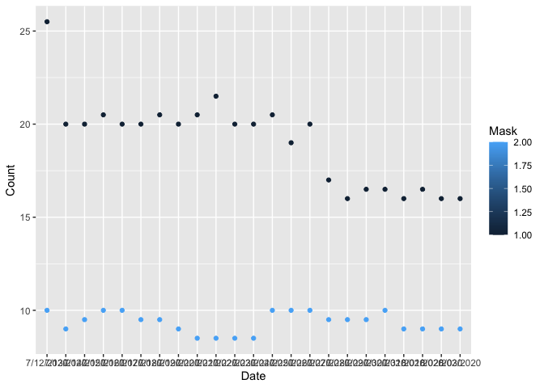

Lab 07 - Conveying the right message through visualisation
================
Lindsay Stall
2/21/22

### Load packages and data

``` r
library(tidyverse) 
library(dsbox)
library(mosaicData) 
```

### Exercise 1

``` r
df <- tribble(
  ~Date, ~Mask, ~Count,
  "7/12/2020", 1, 25.5,
  "7/12/2020", 2, 10,
  "7/13/2020", 1, 20,
  "7/13/2020", 2, 9,
  "7/14/2020", 1, 20, 
  "7/14/2020", 2, 9.5,
  "7/15/2020", 1, 20.5,
  "7/15/2020", 2, 10,
  "7/16/2020", 1, 20,
  "7/16/2020", 2, 10,
  "7/17/2020", 1, 20,
  "7/17/2020", 2, 9.5,
  "7/18/2020", 1, 20.5,
  "7/18/2020", 2, 9.5,
  "7/19/2020", 1, 20,
  "7/19/2020", 2, 9,
  "7/20/2020", 1, 20.5,
  "7/20/2020", 2, 8.5,
  "7/21/2020", 1, 21.5,
  "7/21/2020", 2, 8.5,
  "7/22/2020", 1, 20,
  "7/22/2020", 2, 8.5,
  "7/23/2020", 1, 20,
  "7/23/2020", 2, 8.5,
  "7/24/2020", 1, 20.5,
  "7/24/2020", 2, 10, 
  "7/25/2020", 1, 19,
  "7/25/2020", 2, 10,
  "7/26/2020", 1, 20,
  "7/26/2020", 2, 10,
  "7/27/2020", 1, 17,
  "7/27/2020", 2, 9.5,
  "7/28/2020", 1, 16,
  "7/28/2020", 2, 9.5,
  "7/29/2020", 1, 16.5,
  "7/29/2020", 2, 9.5,
  "7/30/2020", 1, 16.5,
  "7/30/2020", 2, 10,
  "7/31/2020", 1, 16,
  "7/31/2020", 2, 9,
  "8/01/2020", 1, 16.5,
  "8/01/2020", 2, 9,
  "8/02/2020", 1, 16,
  "8/02/2020", 2, 9,
  "8/03/2020", 1, 16,
  "8/03/2020", 2, 9,)
```

### Exercise 2

``` r
df %>%
  ggplot(mapping = aes(y = Count, x = Date, color = Mask)) + geom_point()
```

<!-- -->

### Exercise 3

You can see that counties with masks (light blue) had covid at a much
lower daily cases per 100k people than those without masks (dark blue).

### Exercise 4

In these Kansas counties, counties with masks actually got Covid at a
higher rate, but this may be because the rural counties vs the cities
that wore no masks vs masks.
